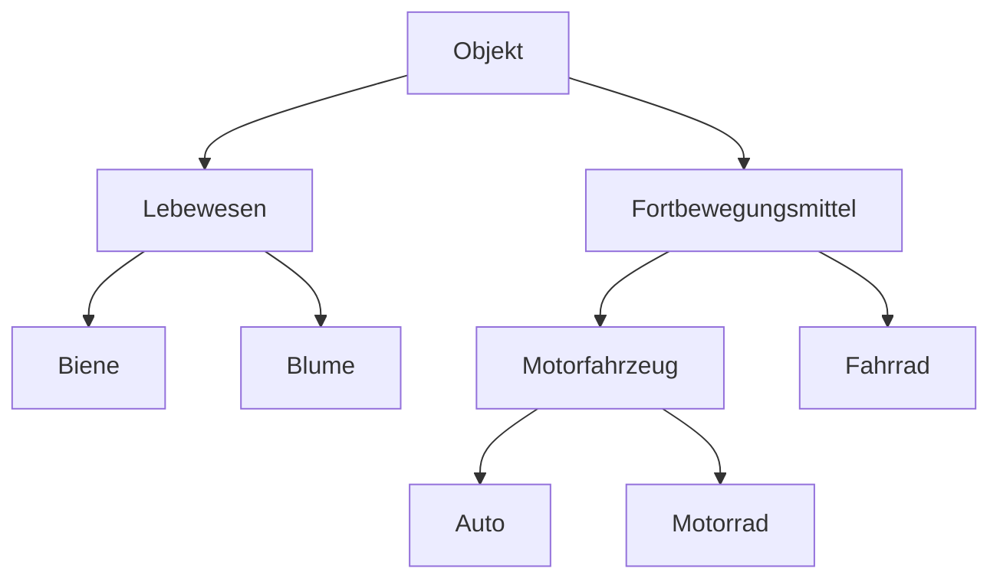

### 1.1 Welches Objekt versteht welche Nachrichten?

| **Klasse**          | **Verstandene Nachricht**        |
| ------------------- | -------------------------------- |
| Fahrrad             | transportierePerson              |
| Lebewesen           | pflanzeDichFort                  |
| Biene               | pflanzeDichFort, sammle Honig    |
| Motorrad            | starteMotor, transportierePerson |
| Motorfahrzeug       | starteMotor, transportierePerson |
| Objekt              |                                  |
| Blume               | pflanzeDichFort, verwelke        |
| Auto                | starteMotor, transportierePerson |
| Fortbewegungsmittel | transportierePerson              |

### 1.2 Klassenhierarchie

### 1.3

- starteMotor: Motorfahrzeug
- transportierePerson: Fahrzeug
- pflanzeDichFort: Lebewesen
- sammleHonig: Biene
- verwelke: Blume

### 1.4

Abstrakte Klassen: Objekt, Lebewesen, Fortbewegungsmittel

### 1.5
